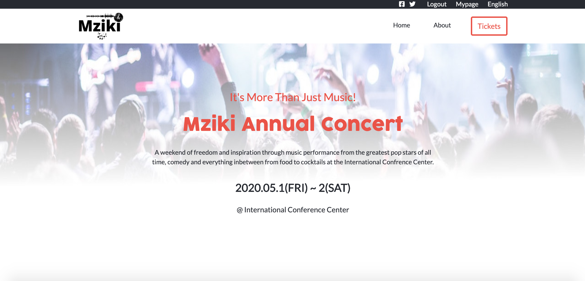

# Concert-Page
This project involves creating concert page templates which includes the main page, the about page and the tickets page

[Live Demo](https://lucid-darwin-900e05.netlify.com/)

## Built With

- HTML
- CSS
- Bootstrap

## Author

- Github: [@mupa1](https://github.com/Mupa1)
- Twitter: [@mupa_mmbetsa](https://twitter.com/mupa_mmbetsa)
- Linkedin: [mupa-mmbetsa](https://www.linkedin.com/in/mupa-mmbetsa)

## Credits 
- Core Design By [Cindy Shin in Behance](https://www.behance.net/adagio07) (see [here](https://www.behance.net/gallery/29845175/CC-Global-Summit-2015))

## 🤝 Contributing

Contributions, issues and feature requests are welcome!

Feel free to check the [issues page](https://github.com/Mupa1/Concert-Page/issues)

## Show your support

Give a ⭐️ if you like this project!

## 📝 License

This project is [MIT](lic.url) licensed.
